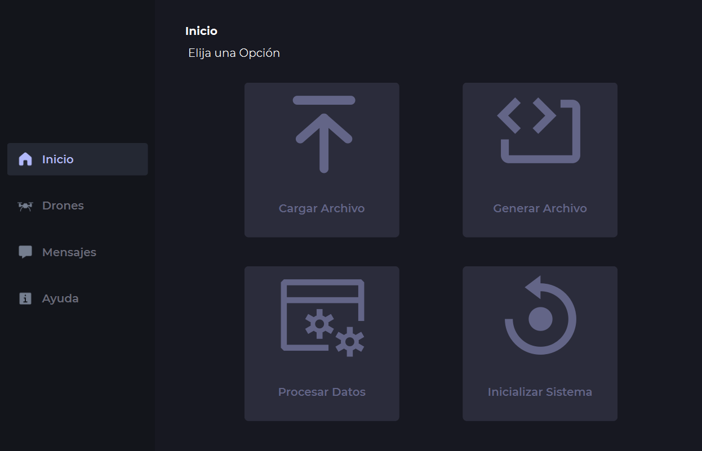
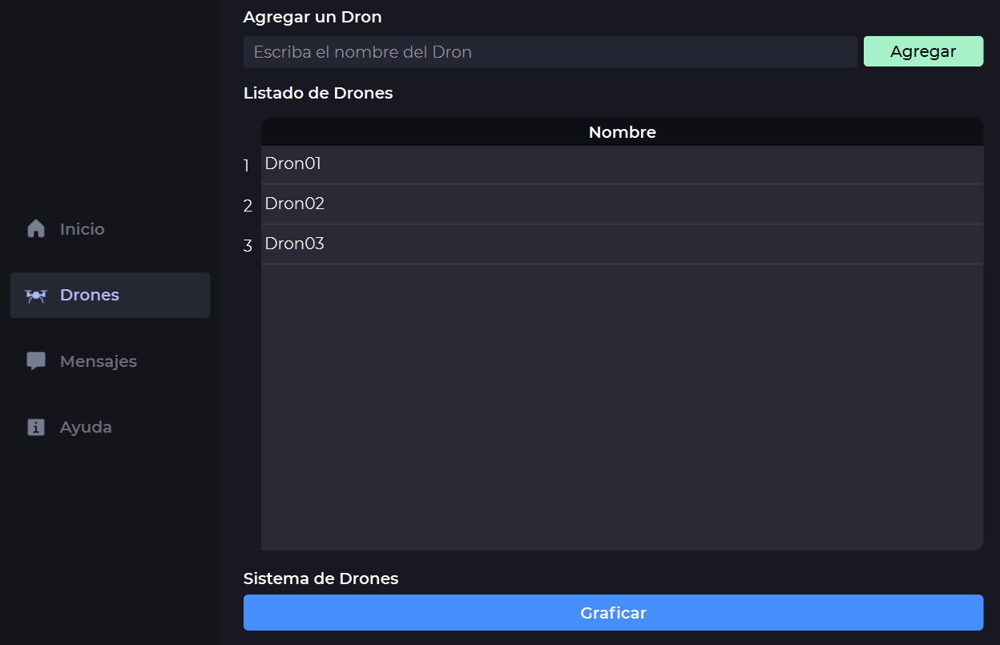
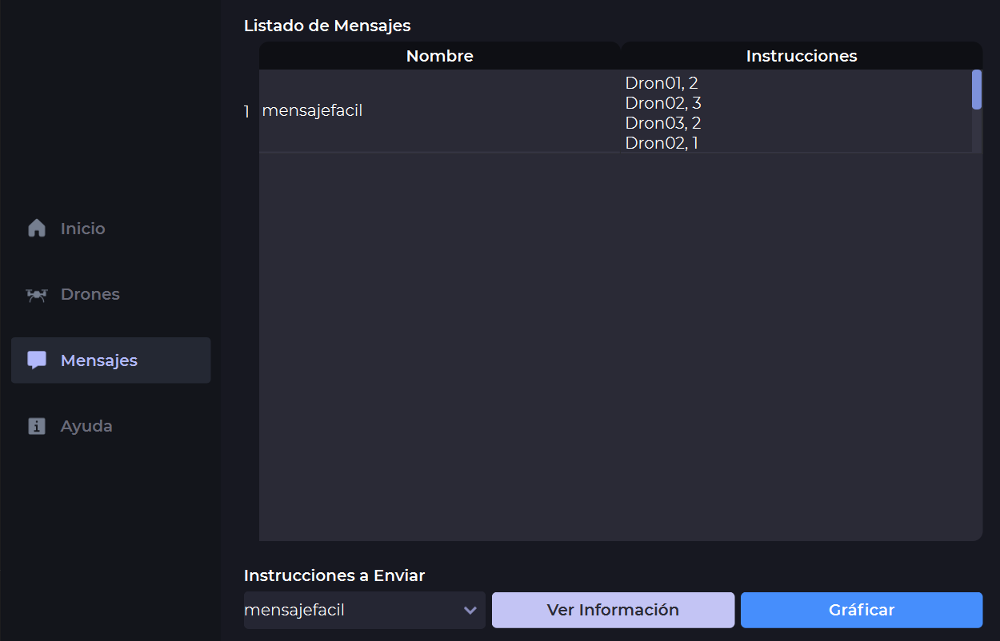
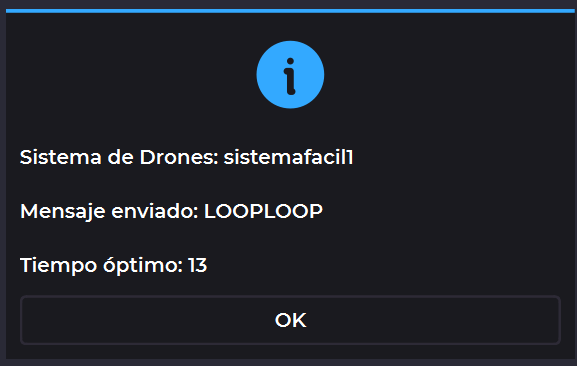
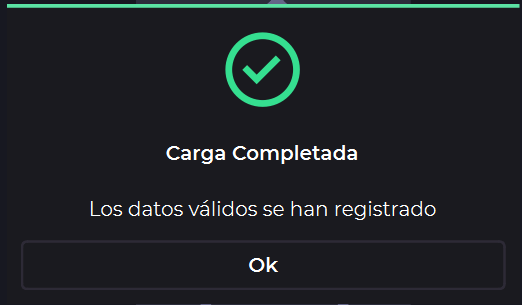
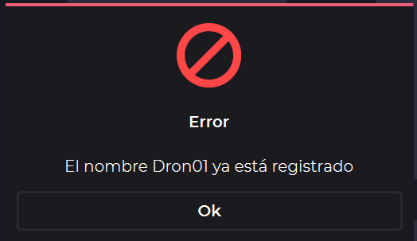
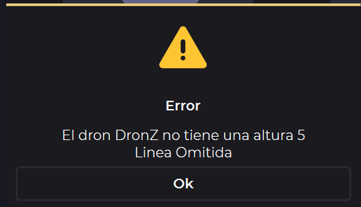

<h1 align="center">Proyecto 2</h1>
<p align="center">
    <a href="#"></a>
</p>
<p align="center">Programa de envio de mensajes encriptados mediante el uso de drones</p>

<div align="center">
🙍‍♂️ Joab Ajsivinac
</div>
<div align="center">
📕 Introducción a la Programación y Computación 2
</div>
<div align="center"> 🏛 Universidad San Carlos de Guatemala</div>
<div align="center"> 📆 Segundo Semestre 2023</div>

## 📋 Tabla de Contenidos

- [📋 Tabla de Contenidos](#-tabla-de-contenidos)
- [⚒ Requerimientos](#-requerimientos)
- [🗂 Recursos](#-recursos)
- [📟 Instalación](#-instalación)
- [⚡ Inicio Rápido](#-inicio-rápido)
- [💻 Interfaz de Usuario y Funcionalidades](#-interfaz-de-usuario-y-funcionalidades)
  - [Inicio](#inicio)
  - [Drones](#drones)
  - [Mensajes](#mensajes)
  - [Ayuda](#ayuda)
  - [Mensajes Emergentes](#mensajes-emergentes)
- [📖 Documentación](#-documentación)


<!-- Requerimientos -->

## ⚒ Requerimientos
<ul>
    <li>Sistemas Opreativos</li>
    <ul>
        <li>Windows 8 o Superior</li>
        <li>macOS Catalina o Superior</li>
        <li>Linux: Ubuntu, Debian, CentOS, Fedora, etc.</li>
    </ul>
    <li>Python 3.11.5 o Superior</li>
    <li>Graphviz 0.20 o superior</li>
    <li>PySide6 6.5.2 o superior</li>
    <li>Fuentes</li>
    <ul>
        <li>Montserrat</li>
    </ul>
</ul>

## 🗂 Recursos
<ul>
  <li><a href="https://www.python.org/downloads/release/python-3115/">Python 3.11.5 o Superior</a></li>
  <li><a href="https://pypi.org/project/PySide6/6.5.2/">PySide6 6.5.2 o superiorr</a></li>
  <li><a href="https://pypi.org/project/graphviz/">Graphviz 0.20 o superior</a></li>
    <li>Fuentes</li>
    <ul>
        <li><a href="https://fonts.google.com/specimen/Montserrat">Montserrat </a></li>
    </ul>
</ul>

## 📟 Instalación
Descargue el código o bien clone el repositorio en una carpeta.

Si se opta por la clonación se hace con la siguiente linea de código en terminal (Antes de ejecutar el codigo asegurese de estar en la carpeta donde lo quiere descargar)

```bash
git clone https://github.com/J-Ajsivinac/IPC2_Proyecto1_202200135.git
```

## ⚡ Inicio Rápido
Una vez con la carpeta del proyecto y teniendo los recursos, dirijase a donde está al archivo `main.py` y ejecutelo de la siguiente forma

```bash
python main.py
```

Luego se ejecutará la aplicación, abriendo una ventana

## 💻 Interfaz de Usuario y Funcionalidades
Al ejecutar el programa se abrirá una ventana, en la cual se elige las opciones requeridas
<p align="center">
    
</p>

La aplicación se divide en 4 secciones, las cuales tienen una funcionalidad especifica.

### Inicio

En este apartado se tendrán los botones para cargar archivos de entrada, procesaro la información, generar archivo de salida, e inicialiazar el sistema

> **Cargar Archivo**
> 
> Al presionar este botón se abrirá una ventana donde se podrá elegir un archivo de entrada en formato xml (existen archivos de entrada validos en la carpeta `inputs`), si ocurre algún inconveniente el programa mostrará un mensaje emergente, indicando la situación. Al finalizar la carga de archivos se mostrará una ventana indicando que la información se cargo exitosamente.

> **Procesar Datos**
>
> Al presionar este botón se procesarán los datos cargados en el apartado de cargar archivo, de igual forma si existe un inconveniente se mostrará un mensaje emeregente indicando la situación. Al finalizar el procesamiento de archivos se mostrará un mensaje indicando que se termino el procesado de datos.

> **Generar Archivo**
>
> Al presionar este botón se abrira una ventana para poder elegir donde se guardará el archivo de salida, en dicha ventana también se podra cambiar el nombre del archivo de salida.

> **Inicializar Sistema**
>
> Al presionar este botón se reiniciaran todas las varibles, incluyendo la carga de datos, y el procesado de datos, por lo que se perderá la información cargada en memoria.

### Drones
<p align="center">
    
</p>

En este apartado se podrá agregar drones (el nombre de los drones es único por lo que si se agrega un dron que ya existe se mostrará una ventana emergente indicando la situación), el sistema tiene un limite de 200 drones.

Además de lo anterior, el programa puede generar una grafica de los sistemas de drones ingresados, esto cuando se presiona el botón de Graficar, crenado una carpeta resultados, donde se guardara una imagen en formato SVG con la información de los sistemas

### Mensajes

<p align="center">
    
</p>

En esta sección se podra ver los distintos mensajes, junto con las instrucciones enviadas (los cuales están en el archivo de entrada)

Además se podra ver las instrucciones a enviar, se podrá ver la información y graficar

> **Ver Información**
>
> En este apartado se desplegará una ventana emergente como la siguiente:
> 
> En la cual se podrá ver el sistema de drones a usar, el mensaje enviado (decodificado)
> y el tiempo óptimo para poder mostrar el mensaje

> **Graficar**
>
> Al presionar el botón se generará un archivo en formato svg, donde se mostrará en forma de tabla las acciones que debe hacer el sistema de drones
> Lista de Acciones:
> * Subir
> * Bajar
> * Esperar
> * Emitir Luz

### Ayuda
En este apartado se verá la información del creador del programa junto con información académica requerida

### Mensajes Emergentes
El programa esta creado de forma que al momento de encontrar algún inconveniente, o completar una acción, se mostrará una ventana emergente en pantalla, teniendo 4 tipos de mensajes emergentes los cuales son:

**Opreación Exitosa**

Se muestra cuando se terminó un proceso, sirve para indicar que se completó una acción, mostrando un mensaje del tipo de acción completada 
<p align="center">
    
</p>

**Error**

Se muestra cuando se encontró un error, y sirve para indicar que tipo de error se encontro, mostrandolo en pantalla
<p align="center">
    
</p>

**Advertencia**

Se muestra cuando se encontró alguna inconsistencia, y sirve para indicar que tipo de inconsistencia se encontro, mostrandolo en pantalla
<p align="center">
    
</p>

**Mostrar Datos de Mensajes**

Se muestra cuando se encontró se quiere ver la información de un mensaje, (como se indico en la sección de Mensajes)
<p align="center">
    
</p>

## 📖 Documentación
Para comprender de mejor manera el funcionamiento del sistema puede, 
<a href="https://github.com/J-Ajsivinac/IPC2_Proyecto2_202200135/blob/main/Doc/Documentacion.pdf">Ver la documentación</a>